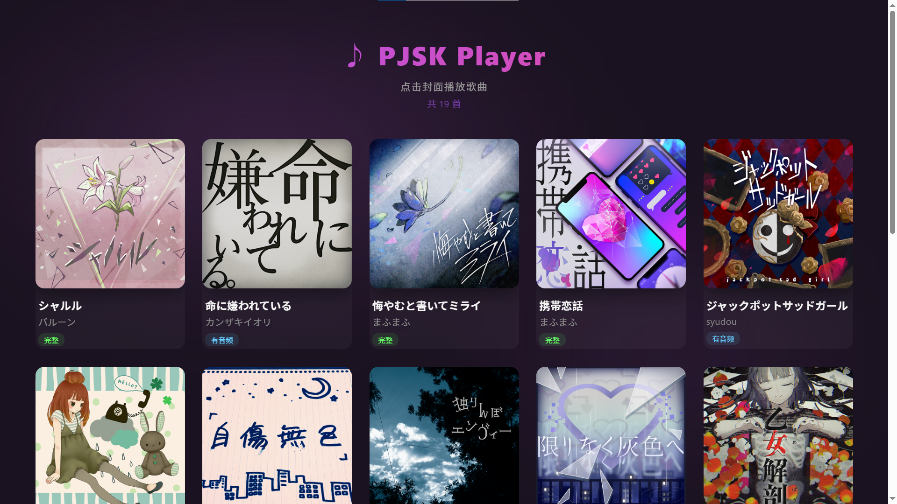
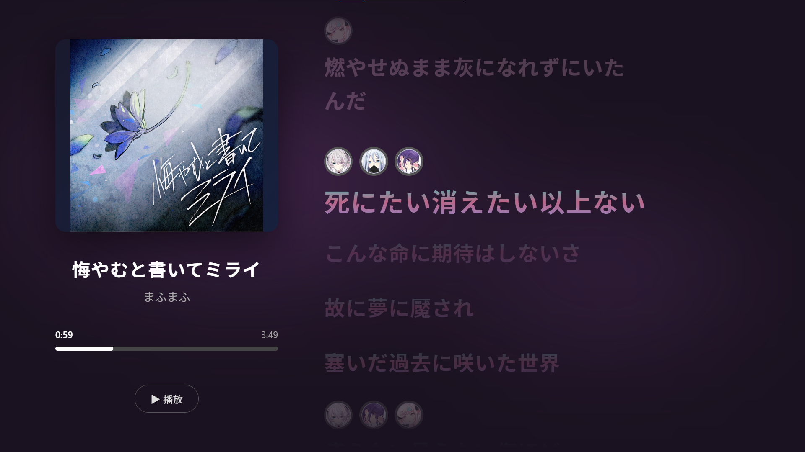
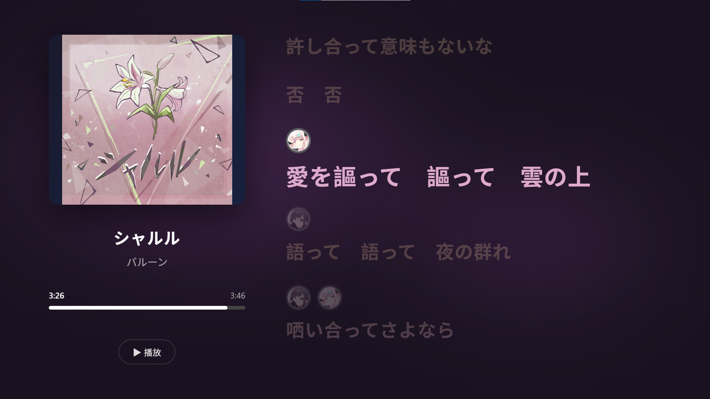

# 🎵 PJSK Player

基于 Web 的《世界计划 多彩舞台！ feat. 初音未来》歌曲播放器，支持多角色分词着色歌词展示。

## ✨ 主要功能

- 🎧 **歌曲库浏览** — 封面墙展示，自由选择歌曲
- 🎤 **分词着色** —  特殊格式，按角色分色显示
- 👤 **角色头像** — 演唱角色切换时自动显示对应头像
- 🎨 **25时主题** — 暗色紫调 UI~~,可切换至其他团体 (计划中)~~
- ⌨️ **键盘控制** — 空格播放/暂停，← → 快进快退
- 📱 **响应式** — 适配桌面、平板、手机，竖屏自动切换纯歌词模式

## 截图演示


*主页*


*测试歌曲1*


*测试歌曲2*

## 🚀 快速开始

1. 将项目放在任意静态服务器下（如 Nginx、Python http.server 等）
2. 打开 `main.html` 浏览歌曲库
3. 点击封面进入播放器

```bash
# 示例：Python 本地服务器
python -m http.server 8080
# 然后访问 http://localhost:8080/main.html
```

## 📁 项目结构

```text
PJSK Player/
├── main.html          # 歌曲库浏览页
├── player.html        # 播放器页面（Vue 3）
├── player.js          # 播放器逻辑
├── player.css         # 播放器样式
├── songs.json         # 歌曲元数据
├── jacket/            # 专辑封面
├── lyrics/            # 歌词文件
├── chara_icons/       # 角色头像
└── .gitignore
```

> 📖 歌曲配置、歌词格式、切换团体等自定义指南详见 [自定义配置指南](./CUSTOM.md)

## 📄 许可

本项目仅供个人学习与娱乐，**不用于任何商业用途**。

歌曲、封面插图及角色素材的版权**均归原作者/版权方所有**。

本项目中的歌曲封面来源于 [sekai-viewer](https://github.com/Sekai-World/sekai-viewer)，部分歌词及分词着色来源于 [萌娘百科](https://zh.moegirl.org.cn)。特此感谢！
